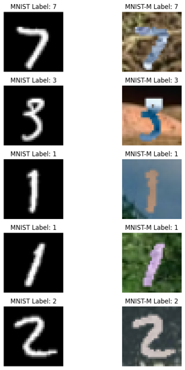
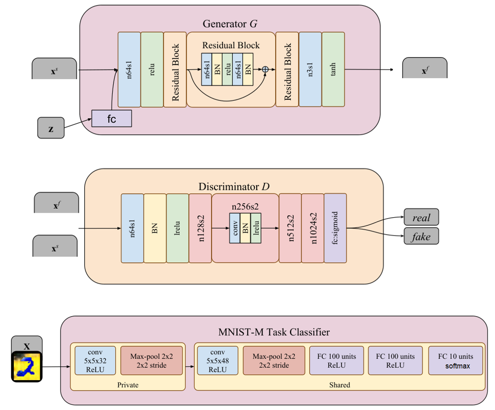
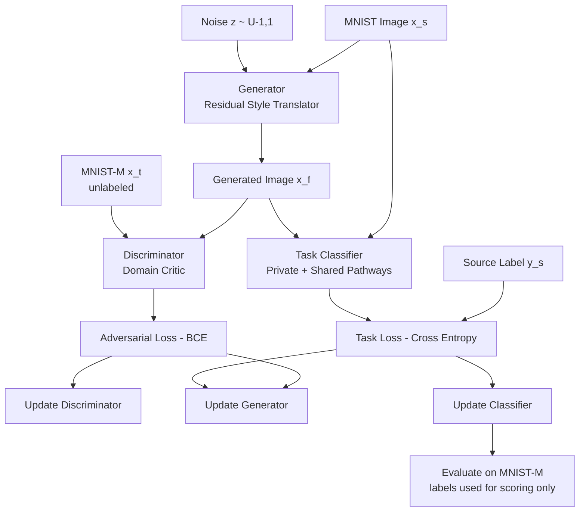
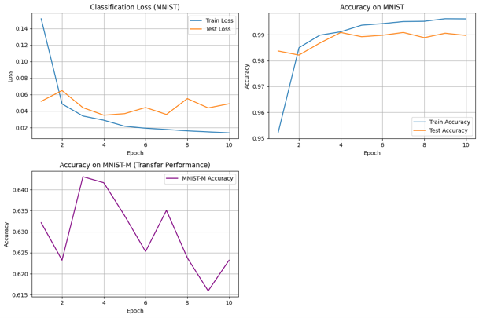
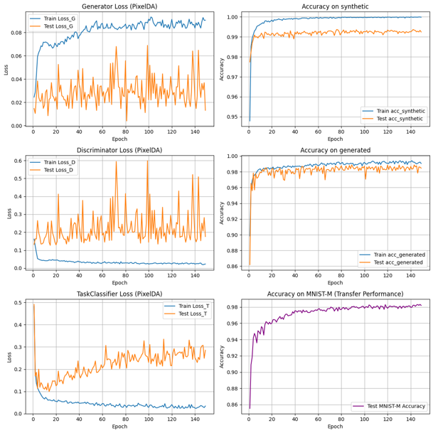
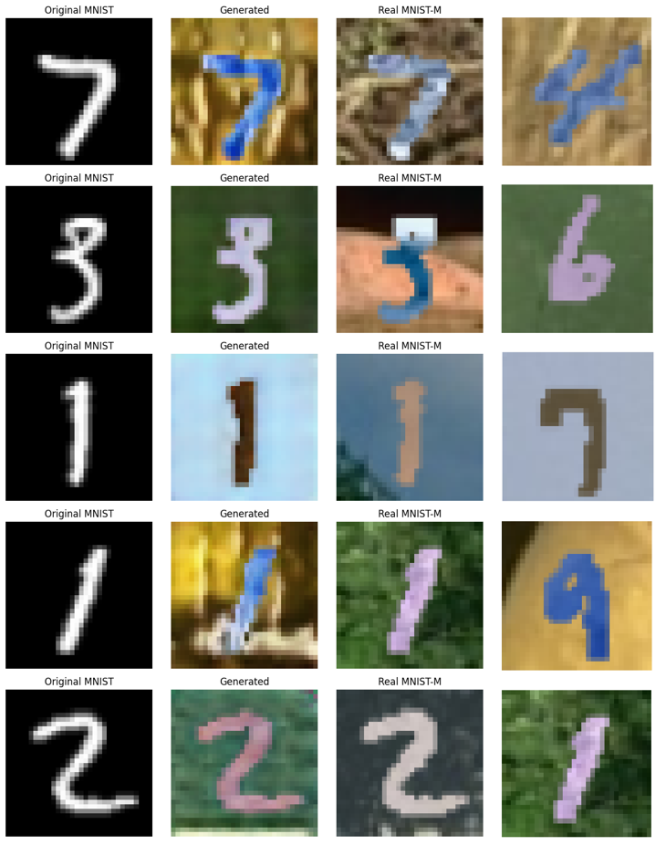

<div align="center">
  
</div>

<p align="center">
  
</p>
---

# Unsupervised Pixel-Level Domain Adaptation with Generative Adversarial Networks

The project demonstrates how a conditional generative adversarial network can translate labeled source-domain images into the visual style of an unlabeled target domain at the pixel level, enabling a task classifier to generalize across a severe domain shift without ever observing a single target-domain label.

<div align="left">

[](https://www.python.org/)
[](https://pytorch.org/)
[](https://pytorch.org/vision/stable/index.html)
[](https://lightning.ai/docs/torchmetrics/stable/)
[](https://scikit-learn.org/)
[](https://numpy.org/)
[](#)
[](#)
[](#)
[](https://opensource.org/licenses/MIT)

</div>

## Abstract

Deep classifiers degrade sharply when the test distribution differs stylistically from the training distribution, a failure mode known as domain shift. This project reimplements PixelDA, a pixel-level unsupervised domain adaptation framework in which a conditional generator maps labeled source images together with a stochastic noise vector into images indistinguishable from unlabeled target-domain data, while a jointly trained task classifier consumes both the original and the translated images. On the MNIST to MNIST-M benchmark, a source-only classifier collapses from 99.09% accuracy on MNIST to 62.76% on MNIST-M. The adapted model reaches 98.16% on MNIST-M using no target labels whatsoever, recovering a 35.4-point gap and landing within 0.22 points of a fully supervised target-domain upper bound of 98.38%.

## Table of Contents

1. [Overview](#overview)
2. [Dataset and Preprocessing](#dataset-and-preprocessing)
3. [System Architecture](#system-architecture)
   - [Generator and Discriminator](#generator-and-discriminator)
   - [Task Classifier](#task-classifier)
4. [Adversarial Training](#adversarial-training)
   - [Update Schedule](#update-schedule)
   - [Configuration](#configuration)
5. [Results](#results)
   - [Domain Gap Baseline](#domain-gap-baseline)
   - [Adapted Model](#adapted-model)
   - [Qualitative Analysis](#qualitative-analysis)
6. [Project Structure](#project-structure)
7. [Installation](#installation)
8. [License](#license)
9. [Author](#author)
10. [Support](#support)

---

# Overview

A classifier trained on one distribution collapses when deployed on data drawn from a visually different distribution, even when the underlying semantics are identical. In practice annotating the target domain is expensive, while labeled synthetic or simplified data is abundant — the asymmetry that unsupervised domain adaptation exploits.

Rather than aligning abstract feature distributions, PixelDA performs adaptation directly in image space: a conditional generator restyles source images to look like target-domain samples while preserving semantic content, after which any downstream model can be trained on the translated data as if it were real target data. The adaptation is visually inspectable, the generator is task-agnostic and reusable, and target labels are never required.

Core capabilities:

* Conditional image-to-image style translation
* Adversarial domain alignment at pixel level
* Label-free target-domain adaptation
* Domain-gap quantification and supervised upper-bound comparison
* Joint qualitative and quantitative evaluation

---

# Dataset and Preprocessing

| Domain | Dataset | Role | Appearance | Labels Used |
| --- | --- | --- | --- | --- |
| Source | MNIST | Supervised training | Grayscale digits, black background | Yes |
| Target | MNIST-M | Adaptation and evaluation | RGB digits on natural-image patches | Evaluation only |

Both datasets preserve sample ordering, so index `i` refers to the same digit in both domains — making it possible to verify directly that the generator alters appearance without corrupting content.

<div align="center">
  
</div>


| Stage | Operation |
| --- | --- |
| Channel alignment | Grayscale to 3-channel RGB |
| Spatial resize | Bilinear resize to `32 × 32` |
| Normalization | Per-channel mean `0.5`, std `0.5` → range `[-1, 1]` |
| Splitting | Stratified 80/20 split on shared indices |

The split yields 56,000 training and 14,000 evaluation samples per domain, with four independent data loaders at batch size 32.

---

# System Architecture

<div align="center">
  
</div>

## Generator and Discriminator

The generator receives a source image and a noise vector `z ∈ [-1, 1]^10` sampled uniformly per example. The noise is spatially broadcast and concatenated as an extra input channel, so the generator defines a stochastic one-to-many mapping rather than a deterministic transformation. A stack of residual blocks then refines appearance while retaining spatial structure, with a `tanh` output matching the `[-1, 1]` data range. Residual connections bias the generator toward *residual restyling* instead of synthesis from scratch, which is the primary mechanism preserving digit identity.

The discriminator is a strided convolutional encoder with a sigmoid head, trained to separate real MNIST-M images from generated ones. Its gradient is the only signal informing the generator about target-domain style.

## Task Classifier

Instead of forcing one feature extractor to absorb residual low-level discrepancies between real and generated images, the classifier uses two domain-private front-ends feeding a shared trunk:

| Block | Composition | Output |
| --- | --- | --- |
| Private (synthetic) | `Conv2d(3 → 32, k=5)` → `ReLU` → `MaxPool(2)` | `32 × 14 × 14` |
| Private (generated) | `Conv2d(3 → 32, k=5)` → `ReLU` → `MaxPool(2)` | `32 × 14 × 14` |
| Shared trunk | `Conv2d(32 → 48, k=5, p=2)` → `ReLU` → `MaxPool(2)` | `48 × 7 × 7` |
| Shared head | `Flatten` → `FC(2352 → 100)` → `ReLU` → `FC(100 → 100)` → `ReLU` → `FC(100 → 10)` | `10` logits |

The private branches absorb domain-specific low-level statistics; the shared trunk is forced to encode only domain-invariant features. All weights are initialized from `N(0, 0.02)`.

---

# Adversarial Training



## Update Schedule

Each mini-batch triggers three sequential optimizer steps:

1. **Discriminator** — classify real target images against detached generated images.
2. **Generator** — fool the discriminator while satisfying the task classifier on generated images, using the non-saturating variant for stronger early gradients.
3. **Classifier** — minimize cross-entropy on real source images and generated images, using source labels only.

Training the classifier on both views simultaneously anchors the generator's output semantics — penalizing any translation that destroys digit identity — while the real source images provide a stationary supervised anchor that prevents overfitting to shifting generator artifacts. Target-domain labels never enter any gradient computation.

## Configuration

| Hyperparameter | Value |
| --- | --- |
| Input resolution | `32 × 32 × 3` |
| Batch size | 32 |
| Noise dimension | 10, sampled from `U(-1, 1)` |
| Optimizer | Adam, `β = (0.5, 0.999)`, `lr = 1e-3` |
| Scheduler | `StepLR`, decay `0.95` every 20,000 steps |
| Losses | BCE (adversarial) + Cross-Entropy (task) |
| Training length | ~105 epochs, 1,750 iterations per epoch |

Independent optimizers and schedulers are maintained per network, and checkpoints with metric logs are serialized every epoch so long adversarial runs can be resumed without loss of state.

---

# Results

## Domain Gap Baseline

A classifier matching the shared-trunk architecture was first trained exclusively on MNIST, then evaluated unmodified on both domains.

<div align="center">
  
</div>

MNIST-M accuracy plateaus in the low sixties from the first epoch and never improves, confirming the gap is distributional rather than an optimization or capacity problem — additional source-domain training cannot close it.

## Adapted Model

<div align="center">
  
</div>

Final metrics: discriminator loss `0.3229`, generator loss `0.0452`, task loss `0.2524`, source accuracy `99.28%`, generated-image accuracy `98.36%`, real target accuracy `98.16%`. The discriminator loss stabilizes in a healthy mid-range rather than collapsing toward zero, indicating neither player overwhelmed the other. Real-target accuracy landing within a fraction of a point of generated-image accuracy is the signature of successful pixel-level alignment.

| Setting | Training domain | Target labels | MNIST accuracy | MNIST-M accuracy |
| --- | --- | --- | --- | --- |
| Source-only baseline | MNIST | No | 99.09% | 62.76% |
| **PixelDA (this work)** | **MNIST + generated** | **No** | **99.28%** | **98.16%** |
| Target-only upper bound | MNIST-M | Yes | — | 98.38% |

**Gap recovered:** `35.40` points, closing `99.4%` of the distance to the supervised upper bound with zero target labels. Source accuracy also improves slightly, indicating the generated images act as an effective style-augmentation regularizer.

## Qualitative Analysis

<div align="center">
  
</div>

* **Style transfer succeeds** — generated images adopt the cluttered, colorful background statistics of MNIST-M.
* **Content is preserved** — stroke topology and digit identity survive translation.
* **Stochasticity is exploited** — resampling the noise vector yields multiple distinct backgrounds per source digit.

Note that the method addresses *low-level* shift only. Domain pairs separated by semantic differences, novel categories, or large viewpoint changes violate this assumption, since no pixel-level restyling can synthesize semantics absent from the source domain.

---

# Project Structure

```text
Unsupervised-Pixel-Level-Domain-Adaptation-with-GANs
│
├── pixelda_domain_adaptation.ipynb
│
├── data/
│   ├── mnist.pkl
│   └── mnistm.pkl
│
├── checkpoints/
│   ├── generator.pt
│   ├── discriminator.pt
│   ├── classifier.pt
│   ├── train_log.pkl
│   └── eval_log.pkl
│
├── assets/
│
├── requirements.txt
│
└── README.md
```

---

# Installation

## Clone Repository

```bash
git clone https://github.com/farzadjannati/Unsupervised-Pixel-Level-Domain-Adaptation-with-GANs.git

cd Unsupervised-Pixel-Level-Domain-Adaptation-with-GANs
```

## Create Environment

```bash
conda create -n pixelda python=3.10

conda activate pixelda
```

## Install Dependencies

```bash
pip install -r requirements.txt
```

## Run

Place `mnist.pkl` and `mnistm.pkl` under `data/`, preserving the original sample ordering, then execute the notebook top to bottom:

```bash
jupyter notebook pixelda_domain_adaptation.ipynb
```

---

# License

This project is licensed under the MIT License.

---

## Author

**Farzad Jannati**
M.Sc. Student, University of Tehran
Research Assistant @ Social Networks Lab

**Research Interests:** NLP, Large Language Models (LLMs), Agentic AI, Retrieval-Augmented Generation (RAG), Generative Models, Domain Adaptation

📧 [farzadjannati@ut.ac.ir](mailto:farzadjannati@ut.ac.ir) | 💻 [github.com/farzadjannati](https://github.com/farzadjannati) | 💼 [linkedin.com/in/farzadjannati](https://www.linkedin.com/in/farzadjannati)

---

# Support

If you find this project useful, consider giving it a star ⭐

---

<p align="center">
  Built with ❤️ using PyTorch and the MNIST / MNIST-M benchmark
</p>
